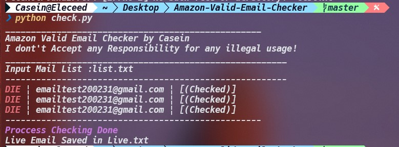

# Amazon Valid Email Checker

### :warning: Warning!

**_I Am Not Responsible of any Illegal Use!_**

## _Valid Email Checker_

> You can use this tool to check if email is registered to Amazon



## ☣Amazon Valid Email Checker☣

## Installation [Windows ](https://wikipedia.org/wiki/Microsoft_Windows)[](https://fr.wikipedia.org/wiki/Microsoft_Windows)

**1.** Install **[Node.JS!](https://nodejs.org/en/download/)**<br>
**2.** Download and extract the **[repository](https://github.com/johnmichaelarc/Amazon-Valid-Email-Checker)** to your pc.<br>
**3.** add list to list.txt file <br>
**4.** live emails save to live.txt file

### Usage

```bash
npm install
npm run start
```

### Bug?

- Submit new issue

### 📧 Contact

- johnmichaelarc@yahoo.com

## Installation [Linux](https://wikipedia.org/wiki/Linux) [](https://fr.wikipedia.org/wiki/Linux)

```bash
git clone https://github.com/csnntrt/Amazon-Valid-Email-Checker.git
cd Amazon-Valid-Email-Checker
npm install
npm run start
```

## Installation [Android](https://wikipedia.org/wiki/Android) [](https://fr.wikipedia.org/wiki/Android)

Download [Termux](https://play.google.com/store/apps/details?id=com.termux)

```bash
git clone https://github.com/csnntrt/Amazon-Valid-Email-Checker.git
cd Amazon-Valid-Email-Checker
npm install
npm run start
```

## Version

**1.0.0**

- Runs in python
- Outdated
- Speed up
- Bug Fixes

**1.0.1**

- Runs in node
- Updated
- Bug Fixes
- Speed low
- More accurate
- 100% working

## LICENSE

_MIT_
