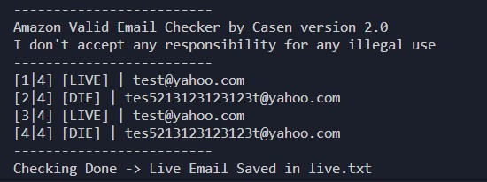

# Amazon Valid Email Checker
## _>Valid Email Checker_
> You can use this tool to check if email is registered to Amazon

## ☣Amazon Valid Email Checker☣

### Usage
```python
python check.py
```

### Bug?
* Submit new issue

### 📧 Contact
* aracostajm0946@gmail.com


## Installation [Linux](https://wikipedia.org/wiki/Linux) [](https://fr.wikipedia.org/wiki/Linux)

```bash
git clone https://github.com/csnntrt/Amazon-Valid-Email-Checker.git
cd Amazon-Valid-Email-Checker
python check.py
```

## Installation [Android](https://wikipedia.org/wiki/Android) [](https://fr.wikipedia.org/wiki/Android)

Download [Termux](https://play.google.com/store/apps/details?id=com.termux)

```bash
git clone https://github.com/csnntrt/Amazon-Valid-Email-Checker.git
cd Amazon-Valid-Email-Checker
python check.py
```
## Installation [Windows ](https://wikipedia.org/wiki/Microsoft_Windows)[](https://fr.wikipedia.org/wiki/Microsoft_Windows)

Download [cmder](https://github.com/cmderdev/cmder/releases/download/v1.3.11/cmder.zip)

```bash
cd Desktop
git clone https://github.com/csnntrt/Amazon-Valid-Email-Checker.git
cd Amazon-Valid-Email-Checker
check.py
```
## Version
**1.0**
* Speed up
* Bug Fixes

## LICENSE
*MIT*